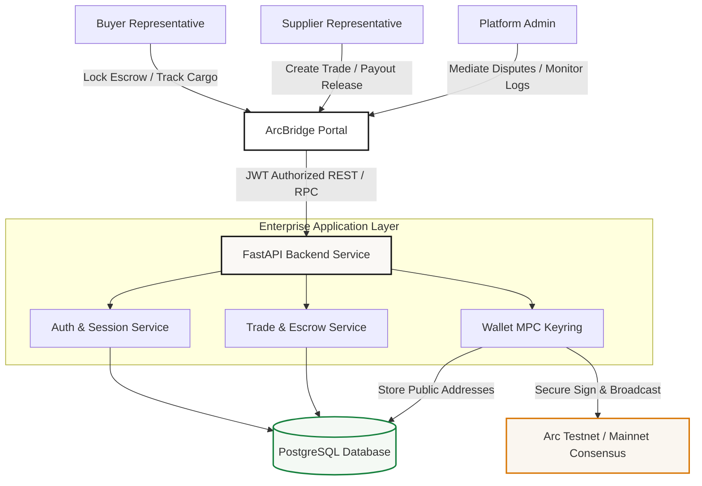

# ArcBridge — Programmable Trade Settlement

<div align="center">
  <p align="center">
    <strong>Delivery-versus-Payment (DvP) Enterprise Trade Settlement Platform</strong>
  </p>
  <p align="center">
    <a href="#why-arc"><b>Why Arc?</b></a> •
    <a href="#features"><b>Features</b></a> •
    <a href="#architecture"><b>Architecture</b></a> •
    <a href="#getting-started"><b>Getting Started</b></a> •
    <a href="#roadmap"><b>Roadmap</b></a>
  </p>
</div>

---

### 🚧 Project Status
**Actively under development.**
* **Current milestone:** Core enterprise business workflows, MPC-simulated key management systems, institutional treasury analytics, and live on-chain ledger modules are fully implemented in the frontend layer with secure sandbox capabilities.
* **Next milestone:** FastAPI backend service integration, direct PostgreSQL database schema bindings, and raw Arc SDK smart contract integration.

---

## 📋 Project Description

**ArcBridge** is a decentralized Delivery-versus-Payment (DvP) trade settlement platform designed for international commerce. The platform enables buyers and suppliers to execute high-volume cross-border trades through programmable escrows, mitigating counterparty risks and eliminating the delays and overhead fees typical of traditional correspondent banking networks.

ArcBridge replaces legacy, manual settlement mechanisms with transparent, automated on-chain agreements. By anchoring settlements to cryptographically secured escrows, ArcBridge ensures that funds are only released to suppliers once certified shipment and customs clearances have been validated.

---

## 🛑 The Problem

International trade currently depends on antiquated, paper-heavy financial systems that introduce substantial frictional costs, operational delays, and counterparty trust gaps:

* **Letters of Credit (LoC):** Slower manual issuance processes that restrict cash flow and charge high issuing fees (1.5% to 3% of trade value).
* **Correspondent Banking Delays:** SWIFT wire transfers can take 3 to 5 business days to clear, exposing participants to foreign exchange volatility.
* **Payment Uncertainty:** Suppliers face the risk of shipping cargo without payment guarantees, while buyers fear upfront payments without receiving verifiable cargo.
* **Dispute Overhead:** Resolving quality anomalies or transit delays takes weeks of manual correspondence, legal documentation, and mediation costs.

---

## ⚡ The Solution

ArcBridge introduces a programmable escrow workflow that guarantees trust, efficiency, and real-time transaction finality. 

```text
Buyer Creates Trade
       ↓
Funds are Locked in Custody Vault
       ↓
Supplier Dispatches Shipment
       ↓
Shipment & Customs Verified
       ↓
Inspection Window Closes
       ↓
Funds Released Automatically to Supplier
```

By transitioning the traditional escrow workflow onto programmatic smart contracts, ArcBridge guarantees:
* **Zero Counterparty Risk:** Funds are locked in smart vaults *before* dispatch, guaranteeing payment availability to the supplier.
* **Automatic Payout Finality:** Deliveries automatically trigger cryptographic settlement without administrative bank delays.
* **Transparent Dispute Mediation:** Interactive quality control and inspection loops to freeze or partially refund escrowed collateral safely.

---

## 🚀 Features

### Core Enterprise Features
* **Role-Based Authentication:** Distinct customized dashboards for **Buyers** (locking escrows, tracking, raising disputes), **Suppliers** (initiating trades, managing consignments, claiming payouts), and **Platform Admins** (resolving disputes, checking ledger metrics, monitoring node logs).
* **Multi-Stage Escrow Engine:** Real-time state transitions from `Created` ➔ `Escrow Locked` ➔ `Shipped` ➔ `Delivered` ➔ `Completed/Settled` (or `Disputed`).
* **Active Shipment Tracking:** Interactive cargo coordinates, bill of lading documentation, port-of-entry statuses, and automated inspection timers.
* **Automated Dispute Center:** Decentralized dispute claim forms, evidence upload structures, and custom settlement distributions (e.g. 50/50 refunds).

### 🌐 Programmable Arc Integration Layer
* **Institutional Company Wallets:** Decentralized business wallets allocated to each company, showcasing public addresses, USDC balances, active escrow bounds, and pending payouts.
* **Multi-Sig MPC Signing Simulator:** Realistic step-by-step cryptographic handshaking that demonstrates JWT-authorized FastAPI requests, postgresql key validation, HSM signing, consensus broadcasting, and final on-chain validation.
* **Treasury Analytics Dashboard:** Comprehensive financial telemetry measuring available t-USDC liquidity, locked escrows, daily trading volume, monthly clearing volume, and average settlement times.
* **On-Chain Settlement Ledger:** Highly filterable auditable transaction ledger providing trade bindings, transaction hashes, gas metrics, block heights, and CSV data export capabilities.
* **Interactive Block Explorer:** Integrated transaction watcher that matches transactions against real block heights, hash strings, and verification status fields.

---

## 🛠️ Tech Stack

### Frontend Architecture
* **Framework:** React 18+ with Vite (Single Page Application)
* **Language:** TypeScript
* **State Management:** Secure client-side state wrappers with resilient sandbox `localStorage` exception handling (to bypass strict iframe restrictions).
* **Styling & Theme:** Tailwind CSS custom styling using professional Swiss editorial design motifs, clean typographic hierarchies, high contrast, and spacious bento grid card layouts.
* **Animations:** Framer Motion (`motion/react`) for smooth micro-interactions, modal transitions, and dynamic step-by-step signing animations.
* **Icons:** `lucide-react` vector iconography.

### Backend (Planned Ecosystem Integration)
* **Framework:** Python FastAPI
* **Database:** PostgreSQL with SQLAlchemy & Migrations
* **Authentication:** JWT (JSON Web Tokens) with cryptographically hashed passwords
* **Key Management:** Multi-Party Computation (MPC) Keyring Service proxying HSMs

---

## 📐 Architecture



---

## 🖼️ Screenshots

### 1. Enterprise Multi-Role Login Portal
*Accessible using quick-login developer shortcuts or registered company credentials.*


### 2. Live Supplier & Buyer Workflows
*Intuitive trade registration boards, automated escrow locking mechanisms, and active port tracking maps.*


### 3. Programmable Treasury Dashboard
*Available liquidity pools, MPC security logs, locked escrow vaults, and average clearing times.*


### 4. Interactive Cryptographic Signing & Block Explorer
*Step-by-step visualizer showing how API requests handshake with HSM hardware to securely broadcast transactions on-chain.*


---

## 📁 Folder Structure

```text
arcbridge-workspace/
├── docs/                       # Project documentation & reference diagrams
│   └── images/                 # High-resolution screenshot assets
├── src/
│   ├── components/             # Reusable design system cards & modals
│   │   ├── ArcExplorer.tsx     # On-Chain Block Explorer & transaction viewer
│   │   ├── WalletTreasury.tsx  # Company Wallet, MPC signing panel & treasury stats
│   │   ├── BuyerDashboard.tsx  # Buyer-specific shipment & dispute metrics
│   │   ├── SupplierDashboard.tsx # Supplier-specific trade templates & payout releases
│   │   ├── AdminDashboard.tsx  # Platform dispute arbitration & global node telemetry
│   │   └── Login.tsx           # Multi-role secure login portal
│   ├── utils/
│   │   └── auth.ts             # Cryptographic password hashing & session managers
│   ├── App.tsx                 # Core application layout, routers & transaction states
│   ├── types.ts                # Strict TypeScript interface declarations
│   ├── main.tsx                # Client entry-point
│   └── index.css               # Global Tailwind CSS configurations
├── package.json                # Project dependency declarations
├── vite.config.ts              # Vite bundle configurations
└── tsconfig.json               # TypeScript strict compilation rules
```

---

## 🚦 Why Arc?

ArcBridge is designed from the ground up to utilize **Arc’s** vision of decentralized financial rails:

* **T-USDC Integration:** Institutional-grade stablecoins that clear instantly, avoiding international banking correspondent networks.
* **Smart Escrows:** Immutable state machines enforcing delivery-versus-payment settlement contracts.
* **On-Chain Governance:** Built-in cryptographic hashes for transit milestones, providing auditable evidence in the event of quality disputes.
* **Low & Predictable Fees:** Fast consensus and minimal gas overhead allow micro-settlements that would be impossible over SWIFT.

---

## 🚀 Getting Started

### Prerequisites
* [Node.js](https://nodejs.org/) (v18 or higher)
* [npm](https://www.npmjs.com/) (v9 or higher)

### Installation & Run
1. **Clone the Repository**
   ```bash
   git clone https://github.com/your-username/arcbridge.git
   cd arcbridge
   ```

2. **Install Dependencies**
   ```bash
   npm install
   ```

3. **Launch the Local Development Server**
   ```bash
   npm run dev
   ```
   *The application will boot on port `3000` (or your proxy configuration).*

4. **Verify Type-Safety & Code Style**
   ```bash
   npm run lint
   ```

---

## 📈 Roadmap

- [x] **Phase 1: Session Security** — Secure company registries, JWT authorization simulation, password hashing, and role-based views.
- [x] **Phase 2: Settlement Engine** — Live trade creation wizard, programmable inspection period workflows, and multi-state dispute centers.
- [x] **Phase 3: Wallet Integration** — Institutional custody cards, t-USDC balance indices, MPC transaction signing simulators, and CSV audit exports.
- [x] **Phase 4: Explorer Ledger** — Real-time block confirmation listings, dynamic indexers, and transaction metadata modals.
- [ ] **Phase 5: FastAPI Core** — Transitioning local states to real backend database schemas and live network REST endpoints.
- [ ] **Phase 6: Arc SDK smart contracts** — Connecting the transaction service to the official Arc network RPC.

---

## 🤝 Contributing

We welcome suggestions, issue reports, and pull requests from the developer community! Since ArcBridge is under active development, please read our contribution guidelines before submitting changes:

1. Fork the repository.
2. Create your feature branch (`git checkout -b feature/amazing-feature`).
3. Commit your changes with professional, standardized commit messages (`git commit -m 'feat: add amazing feature'`).
4. Push to the branch (`git push origin feature/amazing-feature`).
5. Open a Pull Request.

---

## 📄 License

This project is licensed under the **MIT License** — see the [LICENSE](LICENSE) file for details.

---
<div align="center">
  <sub>Built with precision and passion for the Arc Decentralized Finance Ecosystem.</sub>
</div>
